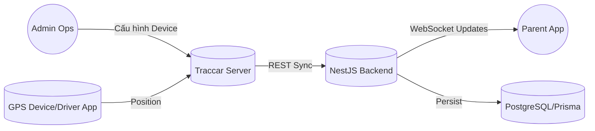
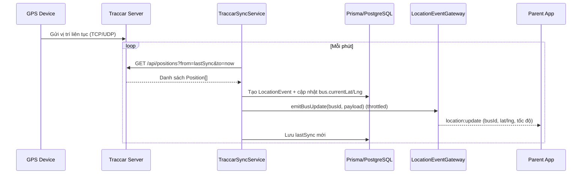
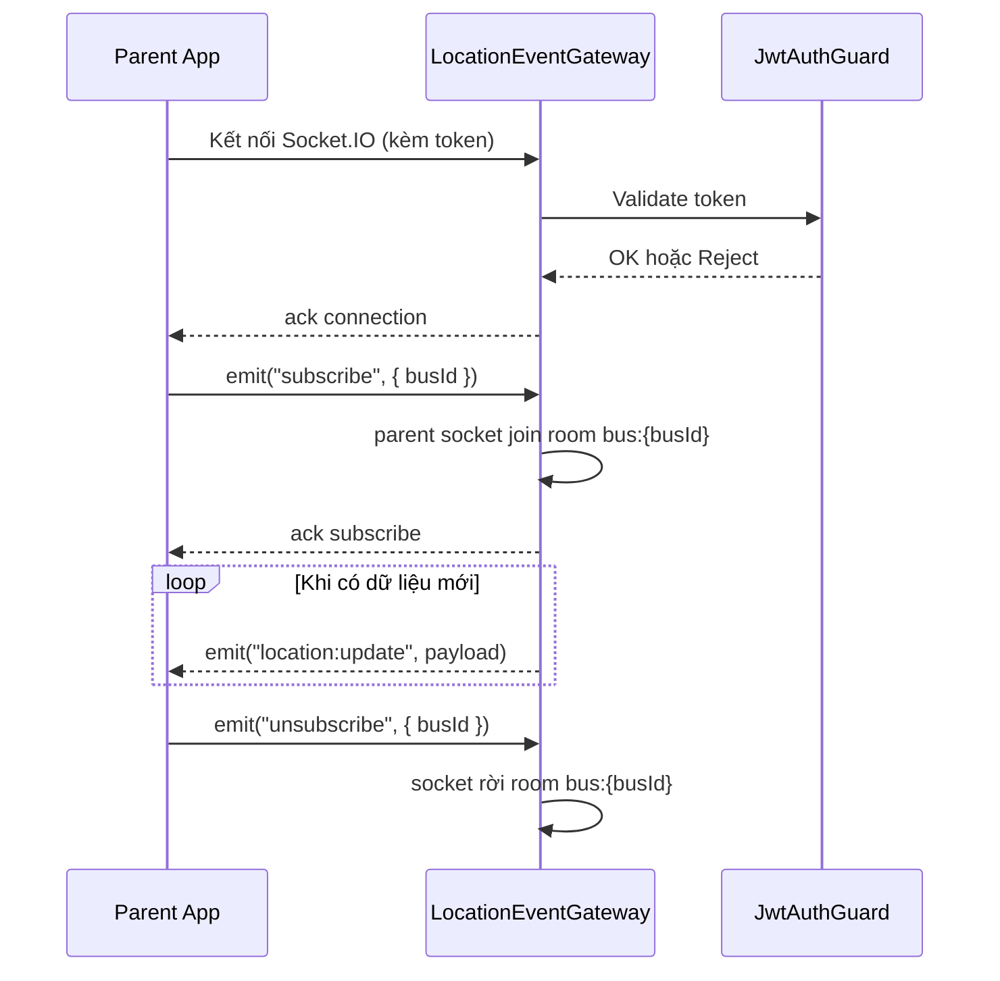

# Phân tích flow tích hợp Traccar với backend School Bus

## 1. Kiến trúc tổng thể

**Mục tiêu:** sử dụng Traccar làm GPS tracking server (ingest dữ liệu thiết bị và chuẩn hoá protocol), backend NestJS đóng vai trò hệ thống nghiệp vụ School Bus.

- **Traccar Server**
  - Nhận dữ liệu từ thiết bị GPS / app Traccar Client (qua TCP/UDP).
  - Lưu `Device`, `Position`, `Event` trong DB riêng.
  - Cung cấp **REST API** và **WebSocket API** cho backend:
    - REST: `/api/devices`, `/api/positions`, `/api/reports/*`, `/api/notifications`, …
    - WebSocket: `/api/socket` stream realtime `positions`, `events`.
  - Tài liệu: `Traccar API – Service functionality & WebSocket`, https://www.traccar.org/traccar-api/ (truy cập 2025-11-26).

- **Backend NestJS (School Bus)**
  - Schema Prisma có các bảng như `bus`, `trip`, `location_event`, `attendance`, …
  - Tích hợp với Traccar qua:
    - **Pull**: gọi REST API theo lịch (cron job) để đồng bộ dữ liệu vị trí, báo cáo.
    - **Push** (khuyến nghị): mở WebSocket đến `/api/socket` để nhận realtime location, sau đó lưu vào `location_event`.

Sơ đồ đơn giản:

```text
GPS Device / Traccar Client
        │  (TCP/UDP)
        ▼
    Traccar Server  ── REST / WebSocket ──►  NestJS Backend  ──►  PostgreSQL (Prisma)
```

## 2. Mô hình map dữ liệu

- **Traccar Device → Bus**
  - `Device.id`        ↔  `bus.traccarDeviceId`
  - `Device.name`      ↔  `bus.name` / `bus.licensePlate`
  - `Device.uniqueId`  ↔  mã phần cứng (IMEI) dùng để khớp thiết bị.

- **Traccar Position → LocationEvent**
  - `Position.deviceId`  ↔  `location_event.busId` (thông qua map sang `bus`)
  - `Position.latitude` / `longitude` ↔  `location_event.lat` / `lng`
  - `Position.speed`, `altitude`, `course`, `attributes` ↔ các cột mở rộng.
  - Thời gian `Position.serverTime` hoặc `fixTime` ↔ `location_event.timestamp`.

- **Traccar Event → Notification / Trip / Attendance**
  - Tuỳ loại `Event.type` (geofenceEnter, geofenceExit, overspeed, …) map sang:
    - bảng `notification` (cảnh báo cho phụ huynh/admin),
    - hoặc cập nhật trạng thái `trip` (ví dụ bắt đầu/kết thúc chuyến).

## 3. Flow sử dụng Traccar demo server trong quá trình phát triển

Trong giai đoạn dev/test, có thể tận dụng **Traccar demo server** để không phải tự dựng server và mua thiết bị thật:

1. **Chuẩn bị thông tin demo**
   - Dùng tài khoản demo mà Traccar cung cấp (hoặc tự đăng ký trên demo).
   - Lấy base URL demo, ví dụ: `https://demo.traccar.org` (cần kiểm tra docs mới nhất trên `https://www.traccar.org/`).

2. **Backend gọi REST API demo**
   - Tạo service NestJS (ví dụ `TraccarService`) với HTTP client (Axios/Nest HttpModule).
   - Các API thường dùng:
     - `GET /api/devices` – lấy danh sách thiết bị demo.
     - `GET /api/positions` – lấy vị trí mới nhất, có filter `deviceId`, `from`, `to`, `id`.
     - `GET /api/reports/route` – lấy lịch sử hành trình trong khoảng thời gian.
   - Backend nhận JSON từ demo server, map sang entity Prisma và lưu vào DB local.

3. **Flow đồng bộ mẫu (cron job)**
   - Tạo cron (ví dụ mỗi 30–60 giây) gọi:
     1. `GET /api/devices` – cập nhật mapping `traccarDeviceId` ↔ `bus`.
     2. `GET /api/positions?from=<lastSync>&to=<now>` – lấy các position mới.
     3. Với mỗi position mới:
        - resolve `busId` từ `deviceId`,
        - tạo bản ghi `location_event` tương ứng trong DB.

4. **Hạn chế khi dùng demo**
   - Dữ liệu demo là **public**, không gắn với đội xe thật và có thể thay đổi bất kỳ lúc nào.
   - Không nên dùng cho production; chỉ phục vụ mục đích:
     - kiểm thử API integration,
     - test giao diện bản đồ, thông báo, flow trip.

## 4. Flow triển khai thật (self-host hoặc Traccar cloud)

Khi chuyển sang môi trường thật:

1. **Triển khai Traccar riêng**
   - Lựa chọn:
     - Self-host (Docker/VM) trên hạ tầng trường/nhà cung cấp,
     - Hoặc dùng dịch vụ Traccar cloud (có phí).
   - Cấu hình thiết bị GPS hoặc app Traccar Client trỏ về server riêng này.

2. **Cấu hình bảo mật**
   - Bật HTTPS + reverse proxy (Nginx).
   - Tạo user API chuyên dụng cho backend và sinh token (tránh dùng password thô).
   - Hạn chế quyền user chỉ trong phạm vi cần thiết (ví dụ chỉ đọc devices/positions).

3. **Tận dụng WebSocket cho realtime**
   - Backend mở kết nối `wss://<traccar-server>/api/socket` với cookie session hợp lệ.
   - Nhận từng message JSON dạng:
     ```json
     {
       "devices": [...],
       "positions": [...],
       "events": [...]
     }
     ```
   - Với mỗi `positions` mới:
     - map sang `location_event`,
     - cập nhật trạng thái `trip` hiện tại nếu cần.
   - Với `events`:
     - map sang `notification`/cảnh báo,
     - trigger gửi thông báo cho phụ huynh (qua module notification).

4. **Batch sync & báo cáo**
   - Định kỳ dùng các endpoint `/api/reports/*` để:
     - tính toán báo cáo chuyến đi, thời gian dừng, quá tốc độ…,
     - đối soát với logic `trip` nội bộ.


## 6. Use case chi tiết

### 6.1 Bối cảnh chung

- **Admin vận hành:** cấu hình Traccar server, ánh xạ `Device` ↔ `Bus`, theo dõi trạng thái đồng bộ.
- **Driver app (có thể chính là thiết bị GPS):** gửi dữ liệu lên Traccar thông qua TCP/UDP.
- **Backend School Bus:** xử lý cron sync, lưu `LocationEvent`, phát WebSocket.
- **Parent app / Web portal:** đăng nhập, subscribe theo `busId`/`tripId`, hiển thị bản đồ realtime.

### 6.2 Mô tả các use case chính



1. **UC01 – Đồng bộ thiết bị (Admin ↔ Backend ↔ Traccar):**
   - Admin thêm mới hoặc cập nhật device trên Traccar.
   - Cron `GET /api/devices` đồng bộ `bus.traccarDeviceId`.
2. **UC02 – Đồng bộ vị trí định kỳ (Backend ↔ Traccar ↔ DB):**
   - Cron `TraccarSyncService` gọi `GET /api/positions?from..to`.
   - Backend map và lưu vào `location_event`, đồng thời update trạng thái bus.
3. **UC03 – Theo dõi realtime (Parent app ↔ Backend):**
   - Parent app mở WebSocket, gửi event `subscribe` theo `busId/tripId`.
   - Khi có position mới, backend phát thông điệp tới các phòng tương ứng.
4. **UC04 – Báo cáo & cảnh báo (Backend ↔ Notification):**
   - Từ `LocationEvent`/`Traccar Event`, backend kích hoạt notification (ví dụ trễ giờ, geofence).

## 7. Sequence diagram chi tiết

### 7.1 Cron sync vị trí + phát realtime



### 7.2 Parent app subscribe WebSocket



### 7.3 Luồng fallback khi WebSocket mất kết nối

- Parent app phát hiện socket disconnect → tự động gọi REST API `GET /location-events?busId=...&limit=1` để lấy vị trí mới nhất.
- Khi socket reconnect, app gửi lại `subscribe` để tiếp tục nhận realtime.

Các sơ đồ trên giúp team dev/QA hiểu rõ vai trò từng actor, các bước giao tiếp và vị trí cần instrument log/metric để đảm bảo hệ thống vận hành ổn định.

